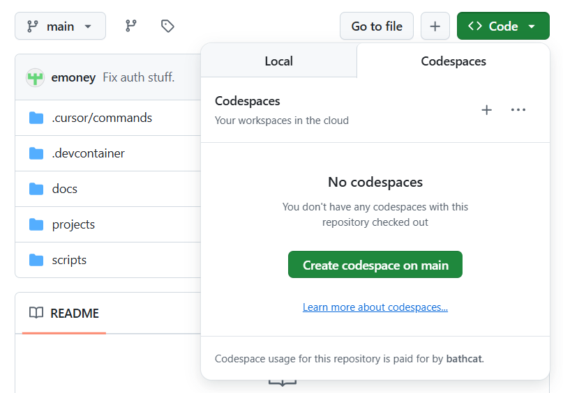
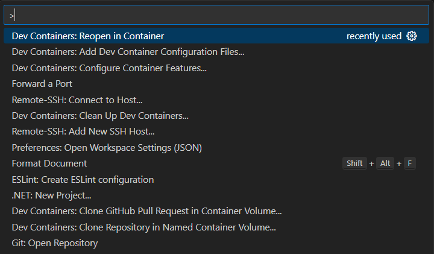

# Mango Bay Setup Guide

This guide provides detailed setup instructions for the Mango Bay Cargo security workshop.

## Contents

- [Option 1: GitHub Codespaces](#option-1-github-codespaces)
- [Option 2: Docker with VS Code](#option-2-docker-with-vs-code)
- [Option 3: Local Installation](#option-3-local-installation)
- [Database Setup](#database-setup)
- [Verification](#verification)
- [Troubleshooting](#troubleshooting)

---

## Option 1: GitHub Codespaces

Run VS Code with Docker entirely in your browser with a free GitHub account.

### Advantages

- Zero installation required
- Consistent environment for all participants
- Works from any computer with a browser

### Disadvantages

- Initial container download takes time
- Free tier has usage limits (60 hours/month)
- Viewing local artifacts (coverage reports, etc.) requires extra steps

### Steps

1. Navigate to https://github.com/bathcat/mango-bay
2. Click **Code** > **Codespaces** > **Create codespace on main**



3. Wait for the container to build and initialize (first time: 5-10 minutes)
4. Once ready, continue to [Verification](#verification)

---

## Option 2: Docker with VS Code

Use Docker containers with VS Code's development container support for a consistent local environment.

### Advantages

- Repeatable environment setup
- No version conflicts with your system
- Artifacts stored on local filesystem
- Faster than Codespaces after initial setup

### Disadvantages

- Requires Docker installation
- Initial setup takes time (10-15 minutes)
- Requires VS Code (or manual container configuration)

### Required Tools

1. [Docker Desktop](https://www.docker.com/get-started/)
2. [VS Code](https://code.visualstudio.com/)
3. [Remote Development extension pack](https://marketplace.visualstudio.com/items?itemName=ms-vscode-remote.vscode-remote-extensionpack)

### Steps

1. Clone the repository:

   ```bash
   git clone https://github.com/bathcat/mango-bay.git
   cd mango-bay
   ```

2. Open the folder in VS Code:

   ```bash
   code .
   ```

3. When prompted, click **Reopen in Container**  
   Or press **F1** > **Dev Containers: Reopen in Container**



4. Wait for container build (first time: 10-15 minutes)
5. Once ready, continue to [Verification](#verification)

---

## Option 3: Local Installation

Install all dependencies directly on your machine.

### Advantages

- Everything runs locally
- No container overhead
- Use any IDE you prefer
- Fastest execution after setup

### Disadvantages

- More setup steps
- Potential version conflicts
- Environment differences between participants
- Tested primarily on Windows

### Required Software

#### .NET 9 SDK

Download from [dotnet.microsoft.com/download/dotnet/9.0](https://dotnet.microsoft.com/en-us/download/dotnet/9.0)

**Verify installation:**

```bash
dotnet sdk check
```

Expected output (versions may vary):

```
.NET SDKs:
Version      Status
----------------------------------------
9.0.205      Up to date.
```

#### Node.js 18+

Download from [nodejs.org](https://nodejs.org/)

**Verify installation:**

```bash
node -v
```

Expected output:

```
v22.15.1
```

#### Git

Download from [git-scm.com/downloads](https://git-scm.com/downloads)

**Verify installation:**

```bash
git --version
```

Expected output:

```
git version 2.46.0.windows.1
```

#### SQL Server (Optional)

Only required for SQL injection exercises. The application uses an in-memory database by default.

Download [SQL Server Express](https://www.microsoft.com/en-us/sql-server/sql-server-downloads) (free)

Any version from the past decade will work. LocalDB on Windows is sufficient.

### Setup Steps

1. Clone the repository:

   ```bash
   git clone https://github.com/bathcat/mango-bay.git
   cd mango-bay
   ```

2. Install Angular dependencies:

   ```bash
   cd projects/web
   npm install
   cd ../..
   ```

3. Restore .NET dependencies:

   ```bash
   cd projects/api
   dotnet restore
   cd ../..
   ```

4. Continue to [Verification](#verification)

---

## Database Setup

### Default: In-Memory Database

No setup required. The application is preconfigured to use an in-memory database that resets on each run. This works for all exercises except SQL injection.

### SQL Server (for SQL Injection Exercises)

1. Ensure SQL Server is running (LocalDB, SQL Server Express, or Docker container)

2. Update connection string in `projects/api/src/MBC.Endpoints/appsettings.json`:

   ```json
   "Database": {
     "Provider": "SqlServer",
     "ConnectionString": "Server=(localdb)\\mssqllocaldb;Database=MangoBayCargo;Trusted_Connection=true;MultipleActiveResultSets=true"
   }
   ```

3. Run migrations:
   ```bash
   cd projects/api
   dotnet ef database update --project src/MBC.Persistence --startup-project src/MBC.Endpoints
   ```

For detailed migration instructions, see `projects/api/src/MBC.Persistence/README.md`

---

## Verification

Test that everything is working:

### Run Both Services

From the repository root:

```powershell
.\scripts\run-watch.ps1
```

This starts both API and web app in watch mode.

### Verify API

1. Navigate to http://localhost:5000/scalar/v1
2. You should see the Scalar API documentation interface
3. Try the `GET /api/v1/pilots` endpoint

### Verify Web App

1. Navigate to http://localhost:4200
2. You should see the Mango Bay home page
3. Try signing up for a new account

### Expected URLs

- **API**: http://localhost:5000
- **Web App**: http://localhost:4200
- **API Documentation**: http://localhost:5000/scalar/v1

### Run Components Separately

**API only:**

```bash
cd projects/api/src/MBC.Endpoints
dotnet run
```

**Web only:**

```bash
cd projects/web
npm start
```

---

## Troubleshooting

### Port Already in Use

If port 5000 or 4200 is already in use:

**API:** Edit `projects/api/src/MBC.Endpoints/appsettings.json` and change the URL
**Web:** Angular will automatically try port 4201, 4202, etc.

### Database Connection Fails

1. Verify SQL Server is running:

   ```bash
   sqlcmd -S (localdb)\mssqllocaldb -Q "SELECT @@VERSION"
   ```

2. Check connection string in `appsettings.json`
3. Try switching back to in-memory provider for non-SQL exercises

### npm install Fails

1. Clear npm cache:

   ```bash
   npm cache clean --force
   ```

2. Delete `node_modules` and `package-lock.json`:
   ```bash
   cd projects/web
   rm -rf node_modules package-lock.json
   npm install
   ```

### Docker Container Won't Start

1. Ensure Docker Desktop is running
2. Try rebuilding the container:
   - **F1** > **Dev Containers: Rebuild Container**

### Module Not Found Errors (.NET)

```bash
cd projects/api
dotnet clean
dotnet restore
dotnet build
```

### Angular Compilation Errors

```bash
cd projects/web
rm -rf node_modules .angular
npm install
```

### Still Having Issues?

Check the following files for additional context:

- `docs/blueprint.md` - Complete technical overview
- `docs/AUTHENTICATION_SETUP.md` - Auth configuration details
- `projects/api/src/MBC.Persistence/README.md` - Database migration guide

---

## Next Steps

Once your environment is running:

1. Explore the application by creating an account and booking a delivery
2. Review `docs/blueprint.md` for complete technical details
3. Familiarize yourself with the project structure
4. Wait for workshop instructions to begin security exercises

---

**Need Help?** Contact your workshop instructor or check the GitHub repository issues.
